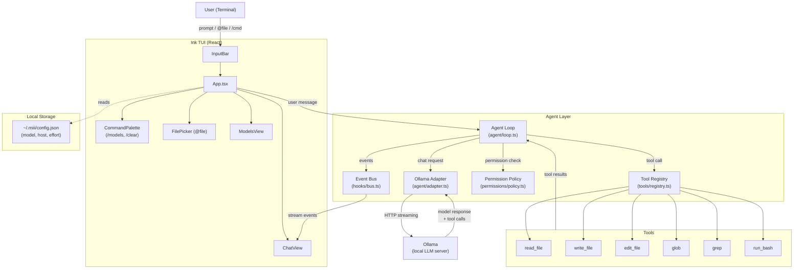

# miii

The local-first AI coding agent for engineers who hate latency.

miii transforms your terminal into a high-performance development environment by pairing a tight Ink TUI with Ollama. It is a zero-config, private companion that can read your code, write your features, and run your tests—all without a single byte leaving your machine.

## Architecture

## The Philosophy

Most AI agents are wrappers around cloud APIs. They are slow, expensive, and a privacy nightmare. miii is different:

1. Local-First: Powered by Ollama. Your code stays on your disk.
2. Zero Ceremony: No API keys. No billing. Just run miii and start coding.
3. Engineering Mindset: miii doesn't just "chat". It treats every request as a bug, feature, or fix. It decomposes problems, executes tools, and verifies results.

## Project Status

This project is currently an MVP designed to demonstrate and refine basic AI coding skills. I am refurbishing older implementations and experimenting with the agent loop. Feel free to fork, modify, or do whatever you want with this codebase.

## Capabilities

miii is equipped with a suite of tools to interact with your workspace:

- File System: read_file, write_file, edit_file (precise string replacement).
- Discovery: glob (pattern matching), grep (regex search).
- Execution: run_bash (shell command execution).

Every sensitive operation is gated by a permission system. You decide what the agent can touch.

## Quick Start

### 1. Prerequisites
- Node.js 18+
- Ollama (running locally via ollama serve)
- A coder model (e.g., ollama pull qwen2.5-coder:14b)

### 2. Install
npm i -g miii-agent

### 3. Launch
miii

## TUI Cheat Sheet

- Type & Enter: Send a prompt to the agent.
- @file: Inline a file's content into the context.
- /models: Switch your active Ollama model.
- /clear: Reset conversation history.
- Esc: Stop the current generation or tool execution.
- Ctrl+C: Quit.

## Configuration

Global settings are stored in ~/.miii/config.json:
- model: Your default LLM.
- ollamaHost: Your Ollama API endpoint.
- effort: Tuning for temperature and limits (low | medium | high).

## Development

git clone https://github.com/maruakshay/miii-cli.git
cd miii-cli
npm install
npm run dev

## License
MIT
