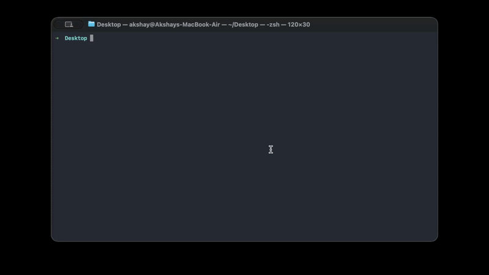
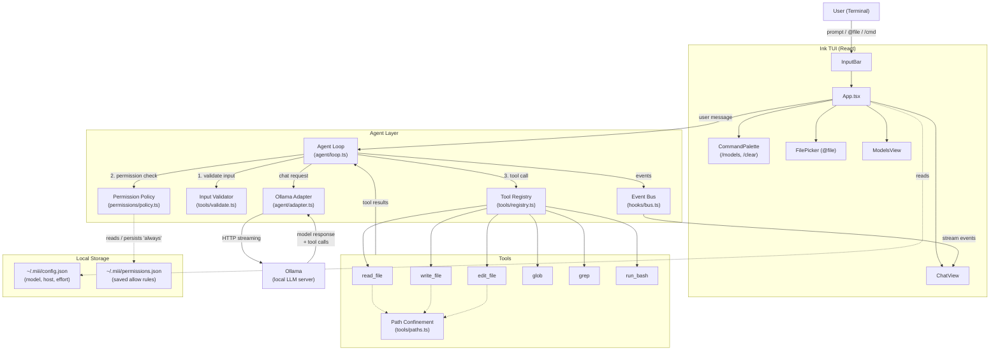

# miii

> small · simple · smart · strategic · semantic
>
> Your code never leaves your machine. No API keys. No cloud. No bullshit.

**miii** is a local-first AI coding agent that lives in your terminal. Powered by [Ollama](https://ollama.com), it reads your code, writes features, runs tests, and fixes bugs — entirely on your hardware, at native speed.

[](https://www.npmjs.com/package/miii-agent)
[](LICENSE)
[](https://nodejs.org)

---

## The name

**miii** stands for five principles it's built around:

- **small** — tight codebase, no bloat. You can read the whole thing.
- **simple** — no API keys, no accounts, no config ceremony. Just run it.
- **smart** — decomposes problems and verifies its own work like an engineer.
- **strategic** — plans before it acts; tools are gated, paths are confined.
- **semantic** — works from the meaning of your code, not blind text matching.

---

## Demo



---

## Why miii?

Most AI coding tools are wrappers around cloud APIs. They're slow, expensive, and send your private code to someone else's server.

miii is different:

- **Local-first** — Powered by Ollama. Your code stays on your disk, period.
- **Zero ceremony** — No API keys. No billing. No accounts. Just `miii`.
- **Actually agentic** — miii doesn't just chat. It decomposes problems, calls tools, and verifies results like an engineer would.
- **Fast** — No network round-trips. Response time is limited by your GPU, not a CDN.

---

## Installation

### Prerequisites

- **Node.js** ≥ 18
- **Ollama** running locally — [install here](https://ollama.com/download)
- A coding model pulled locally:

```bash
ollama pull qwen2.5-coder:14b
# or any model you prefer
ollama pull deepseek-coder-v2
```

### Install miii

```bash
npm install -g miii-agent
```

### Launch

```bash
miii
```

That's it.

---

## Usage

Once inside the TUI, just type naturally:

```
> refactor the auth module to use async/await
> @src/server.ts add rate limiting to all POST routes
> why are my tests failing in utils/parser.ts
```

### Keyboard Shortcuts

| Key | Action |
|-----|--------|
| `Enter` | Send prompt |
| `@filename` | Attach file to context |
| `/models` | Switch active Ollama model |
| `/clear` | Reset conversation history |
| `Esc` | Stop current generation or tool run |
| `Ctrl+C` | Quit |

---

## Configuration

Settings live in `~/.miii/config.json` and are created on first run.

```json
{
  "model": "qwen2.5-coder:14b",
  "ollamaHost": "http://localhost:11434",
  "effort": "medium"
}
```

| Field | Description | Values |
|-------|-------------|--------|
| `model` | Default Ollama model | any `ollama list` model |
| `ollamaHost` | Ollama API endpoint | URL string |
| `effort` | Controls temperature & limits | `low` \| `medium` \| `high` |

---

## Capabilities

miii ships with a built-in tool suite the agent can invoke autonomously:

| Tool | What it does |
|------|-------------|
| `read_file` | Read any file in your workspace |
| `write_file` | Create new files |
| `edit_file` | Precise string-level edits (no rewrites) |
| `glob` | Pattern-match files across the project |
| `grep` | Regex search across files |
| `run_bash` | Execute shell commands |

Every sensitive operation is gated by a permission system — you approve what the agent can touch, and "always" approvals persist to `~/.miii/permissions.json` so you're never asked twice. File tools are confined to your working directory; `../` traversal and absolute paths outside it are rejected.

---

## Checking your setup

miii is model-agnostic — but not every local model can actually drive an agent. A model that can't emit clean tool calls will chat at you instead of editing files. `miii doctor` tells you which of *your* installed models are up to the job, before you waste time wondering why nothing happens.

```bash
miii doctor                     # check every local model (from `ollama list`)
miii doctor qwen2.5-coder:7b    # check one model
miii doctor gemma4:e4b grep     # one model, only scenarios matching "grep"
```

It runs the real agent against a handful of concrete tasks (edit a file, read-and-answer, create a file, locate a definition) and checks the *outcome* — did the file actually change, was the answer right — then prints a verdict per model:

```
=== qwen3-coder ===
PASS  edit-exact-string   ...
PASS  read-then-answer    ...
PASS  create-new-file     ...
PASS  grep-locate         ...
  → qwen3-coder: 4/4 — ready

=== gemma4:e4b ===
  → gemma4:e4b: 1/4 — not recommended — weak tool-calling
```

With more than one model it also prints a compatibility matrix (`+` pass, `.` fail). Cloud models are skipped by default; name one explicitly to include it. If a model comes back `marginal` or `not recommended`, pull a stronger coding model and try again.

---

## Architecture



---

## Development

```bash
git clone https://github.com/maruakshay/miii-cli.git
cd miii-cli
npm install
npm run dev
```

```bash
npm run build       # production build
npm run start       # run built output
npm run typecheck   # type-check src + eval
npm run eval        # run the eval harness as a CI / regression gate
```

The eval harness lives in `eval/` and powers `miii doctor`. As `npm run eval` it doubles as a regression gate — it exits non-zero if any model fails any scenario, so a prompt or tool change that regresses a baseline model is caught in CI. Same engine, two doors: `miii doctor` for users checking their setup, `npm run eval` for maintainers gating changes.

### Testing the `miii` command against your local changes

The global `miii` command points at whatever was last installed with `npm install -g miii-agent` — **not** your working tree. After editing source, the global binary is stale, so `miii` (and `miii doctor`) will run the old code and may appear to ignore your changes (e.g. printing the wrong model). Two ways to run your local build:

```bash
node dist/cli.js doctor <model>   # run the freshly built output directly
# — or —
npm run build && npm link         # point the global `miii` at this repo
```

`npm link` symlinks the global `miii` to `dist/cli.js` in this repo, so each `npm run build` is picked up automatically. Restore the published version later with `npm install -g miii-agent`. Note: `npm run dev` / `npm run start` always run the current source and never have this staleness problem.

## Project Status

MVP. Core agent loop works. Actively refining tool execution, streaming, and the permission model. PRs welcome — fork it, break it, improve it.

---

## License

MIT © [maruakshay](https://github.com/maruakshay)

---

<p align="center">
  Built for engineers who'd rather own their tools than rent them.
</p>
