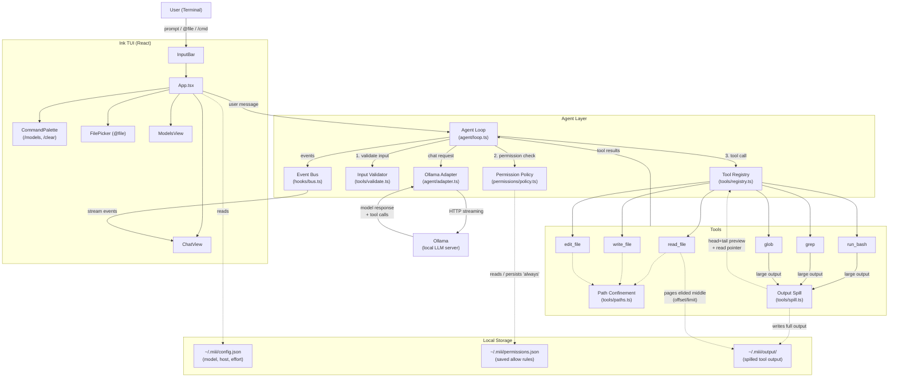

<h1 align="center">miii</h1>

<p align="center">
  <strong>Small. Simple. Smart. Strategic. Semantic.</strong>
</p>

<p align="center">
  A local-first AI coding agent that lives in your terminal.<br>
  Your code never leaves your machine. No API keys. No cloud. No bullshit.
</p>

<p align="center">
  <a href="https://www.npmjs.com/package/miii-agent"></a>
  <a href="LICENSE"></a>
  <a href="https://nodejs.org"></a>
  <a href="https://ollama.com"></a>
</p>

miii is a local-first AI coding agent that lives in your terminal. Powered by [Ollama](https://ollama.com), it reads your code, writes features, runs tests, and fixes bugs — entirely on your hardware, at native speed.

---

## Contents

- [Demo](#demo)
- [The Local-First Advantage](#the-local-first-advantage)
- [Core Philosophy](#core-philosophy)
- [Quick Start](#quick-start)
- [Interaction Guide](#interaction-guide)
- [Technical Deep Dive](#technical-deep-dive)
- [Configuration](#configuration)
- [System Architecture](#system-architecture)
- [Development](#development)
- [Project Status](#project-status)
- [License](#license)

---

## Demo


---

## The Local-First Advantage

Most AI coding tools are wrappers around cloud APIs. They are slow, expensive, and require you to trust your private codebase to a third-party server.

miii flips the script:

- **Absolute Privacy** — Powered by Ollama. Your code stays on your disk, period.
- **Zero Friction** — No API keys, no billing, no accounts. Just `miii`.
- **True Agency** — miii doesn't just chat; it decomposes problems, invokes tools, and verifies results like a senior engineer.
- **Native Performance** — No network round-trips. Latency is limited by your GPU, not a CDN.

|                | Cloud AI agents          | **miii**                     |
|----------------|--------------------------|------------------------------|
| Your code      | Sent to a third party    | Never leaves your machine    |
| Cost           | Per-token billing        | Free — runs on your hardware |
| Setup          | API keys, accounts       | `npm i -g miii-agent`        |
| Offline        | No                       | Yes                          |
| Latency        | Network + queue          | Your GPU only                |

---

## Core Philosophy

miii is built on five foundational principles:

- **small** — A tight, bloat-free codebase. You can read the entire project in an afternoon.
- **simple** — No configuration ceremony. Install and run.
- **smart** — Decomposes complex tasks and verifies its own work.
- **strategic** — Plans before acting; tools are gated and paths are confined.
- **semantic** — Operates on the meaning of your code, not blind text matching.

---

## Quick Start

### Prerequisites

- **Node.js** ≥ 18
- **Ollama** running locally — [Download here](https://ollama.com/download)
- A coding model pulled locally:

```bash
ollama pull qwen2.5-coder:14b
# or any model you prefer
ollama pull deepseek-coder-v2
```

### Installation & Launch

```bash
npm install -g miii-agent
miii
```

---

## Interaction Guide

Inside the TUI, interact naturally:

```
> refactor the auth module to use async/await
> @src/server.ts add rate limiting to all POST routes
> why are my tests failing in utils/parser.ts
```

### Keyboard Shortcuts

| Key | Action |
|-----|--------|
| `Enter` | Send prompt |
| `@filename` | Attach file to context |
| `/models` | Switch active Ollama model |
| `/clear` | Reset conversation history |
| `Esc` | Stop current generation or tool run |
| `Ctrl+O` | Toggle full tool output view |
| `Ctrl+C` | Quit |

---

## Technical Deep Dive

### Capabilities

miii ships with a built-in tool suite that the agent invokes autonomously:

| Tool | Function |
|------|----------|
| `read_file` | Read any file in your workspace |
| `write_file` | Create new files |
| `edit_file` | Precise string-level edits with whitespace tolerance (no rewrites) |
| `glob` | Pattern-match files across the project |
| `grep` | Regex search across files |
| `run_bash` | Execute shell commands |

**Security & Safety:** Every sensitive operation is gated by a permission system. You approve what the agent can touch, and "always" approvals persist to `~/.miii/permissions.json`. File tools are strictly confined to your working directory; `../` traversal and absolute paths outside the workspace are rejected.

### Lossless Output Spill

Big tool outputs (like 50K-line test logs) usually get truncated, leaving the model to guess. miii doesn't truncate; it **spills**.

When a tool result exceeds the inline budget (~10K bytes), the full output is written to `~/.miii/output/<id>.txt`. Only a head + tail **preview** is inlined, followed by a pointer:

```
[command output truncated: 5184 lines / 412900 bytes.
 Full output at ~/.miii/output/9f3a1c.txt — read it with
 read_file offset/limit to see the elided middle.]
```

If the model needs the elided middle, it pages through it using `read_file` ranged reads. Nothing is ever lost. Spill files are garbage-collected after 24 hours.

### The Model Doctor

Not every local model can drive an agent. A model that cannot emit clean tool calls will simply chat at you instead of editing files. `miii doctor` validates your installed models against concrete engineering tasks.

```bash
miii doctor                     # check every local model (from `ollama list`)
miii doctor qwen2.5-coder:7b    # check one model
miii doctor gemma4:e4b grep     # check one model against "grep" scenarios
```

It verifies outcomes (did the file actually change?) and prints a verdict:

```
=== qwen3-coder ===
PASS  edit-exact-string   ...
PASS  read-then-answer    ...
PASS  create-new-file     ...
PASS  grep-locate         ...
  → qwen3-coder: 4/4 — ready

=== gemma4:e4b ===
  → gemma4:e4b: 1/4 — not recommended — weak tool-calling
```

---

## Configuration

Settings live in `~/.miii/config.json` and are created on first run.

```json
{
  "model": "qwen2.5-coder:14b",
  "ollamaHost": "http://localhost:11434",
  "effort": "medium"
}
```

| Field | Description | Values |
|-------|-------------|--------|
| `model` | Default Ollama model | any `ollama list` model |
| `ollamaHost` | Ollama API endpoint | URL string |
| `effort` | Controls temperature & limits | `low` \| `medium` \| `high` |

---

## System Architecture



---

## Development

### Setup

```bash
git clone https://github.com/maruakshay/miii-cli.git
cd miii-cli
npm install
npm run dev
```

### Build & Test

```bash
npm run build       # production build
npm run start       # run built output
npm run typecheck   # type-check src + eval
npm run eval        # run the eval harness as a CI / regression gate
```

The eval harness in `eval/` powers `miii doctor` and serves as a regression gate. If `npm run eval` exits non-zero, a prompt or tool change has regressed a baseline model.

### Testing Local Changes

The global `miii` command points to the last installed version of `miii-agent`. To run your local working tree:

```bash
node dist/cli.js doctor <model>   # run the freshly built output directly
# — or —
npm run build && npm link         # point the global `miii` at this repo
```

`npm link` symlinks the global `miii` to `dist/cli.js` in this repo. Restore the published version later with `npm install -g miii-agent`.

---

## Project Status

**MVP.** Core agent loop is stable. Actively refining tool execution, streaming, and the permission model. PRs are welcome — fork it, break it, improve it.

---

## License

MIT © [maruakshay](https://github.com/maruakshay)

---

<p align="center">
  Built for engineers who'd rather own their tools than rent them.
</p>
